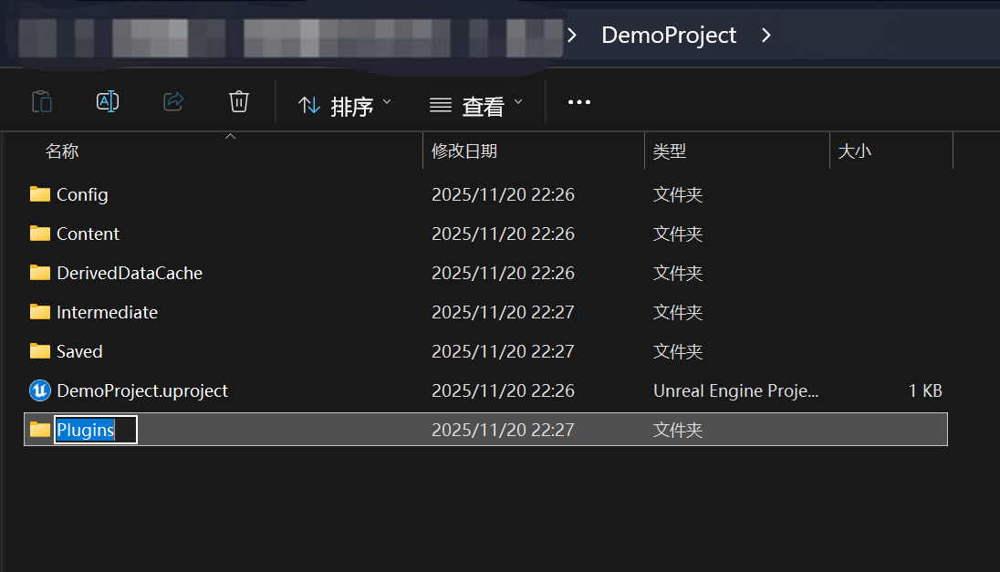
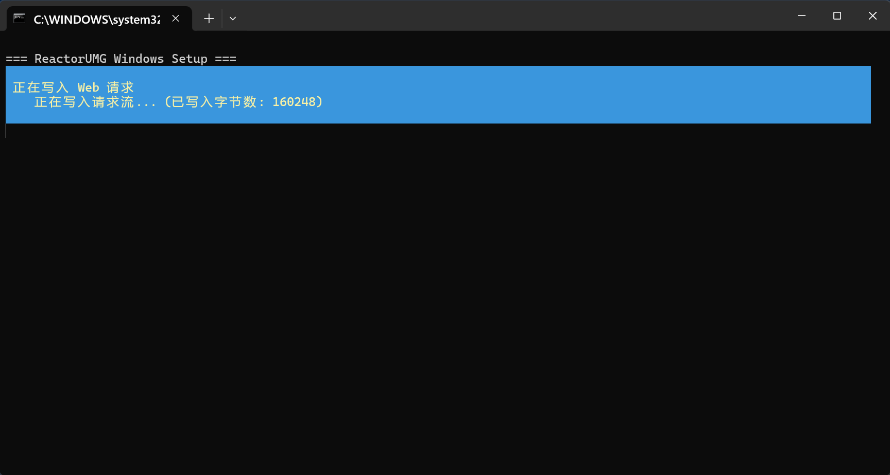
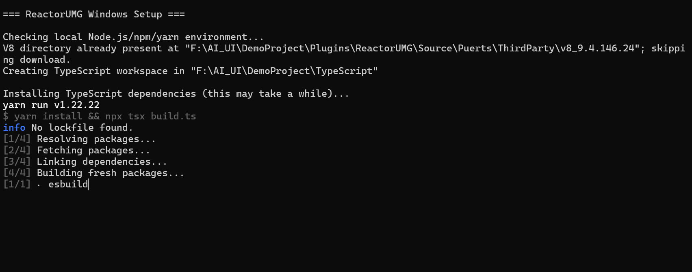

# 快速入门

> 快速入门旨在帮助您从零开始体验如何在UE中使用React UI开发出一套简单的编辑器工具界面。在这过程中，我们将借助AI Coding来实现所有代码逻辑，以此说明AI Coding可以为UE的原生UI开发带来什么样的可能性。最后我们也会介绍游戏UI的创建和使用，以及对 React UI 的运行原理做简单讲解。

> 整篇文章内容划分成九个部分，它们分别是：

> - 插件安装
> - 环境初始化
> - 创建编辑器UI
> - AI Coding
> - 预览和运行
> - 创建游戏UI
> - 脚本打包
> - 目录解读
> - 运行原理介绍

> 我们推荐您按以上顺序依次阅读并实践，您也可以选择您感兴趣的任意章节进行查看。

## 插件安装

插件的安装方式有两种：一）直接下载使用对应引擎版本的预编译版本；二）从源码编译。
接下来我们将具体介绍这两种安装方式的操作步骤。

### 预编译版本
从github项目的[Release]()中选择您对应的引擎版本插件下载预编译好的zip文件。例如UE5.4对应的预编译版本文件名为ReactorUMG_UE5_4.zip。
下载解压后您可以选择放置到引擎插件目录，也可以放置到项目目录**（推荐）**。

- 引擎插件目录

将zip文件解压后得到的`ReactorUMG`目录拷贝到`Engine/Plugins/Marketplace/`下（如果在`Engine/Plugins`没有`Marketplace`目录，那么直接新建一个文件夹即可）

{width=400}
{width=400}

并且在项目的`MyProject.uproject`uproject文件中启用插件：

{width=500}

- 项目目录**（推荐）**

**我们强烈推荐直接安装到项目目录，安装到引擎目录会影响所有项目。**

将zip文件解压后得到的`ReactorUMG`目录放置到项目的`Plugins`目录，参考以下示例：

{width=400}
{width=505}

### 源码编译

源码编译适用于大多数有UE程序经验的开发者，适合在C++项目或源码版引擎下使用，下面不赘述具体的编译过程，只列出关键步骤。

- 下载插件源码放置到项目`Plugins`目录；
- 完成[环境初始化](#eng_init)；
- 重新生成`Visual Studio project files`；
- 在Visual Studio或Rider中执行编译，并启动项目；

## 环境初始化 {#eng_init}

进入插件目录，找到`Plugins/ReactorUMG/Tools/setup_win.bat`环境初始化脚本。

{width=700}

注：暂不支持setup_linux.sh。

**双击执行**，执行过程如下：

{width=370}
{width=500}

初始化完成

{width=600}

环境初始化完成后就可以双击uproject文件来启动项目了。

## 创建编辑器UI

## AI Coding

## 预览和运行

## 创建游戏UI

## 脚本打包

## 目录解读

## 运行原理介绍
