# 快速开始

> 快速入门旨在帮助您从零开始体验如何在UE中使用React UI开发出一套简单的编辑器工具界面。在这过程中，我们将借助AI Coding来实现所有代码逻辑，以此说明AI Coding可以为UE的原生UI开发带来什么样的可能性。最后我们也会介绍游戏UI的创建和使用，以及对 React UI 的运行原理做简单讲解。

> 整篇文章内容划分成九个部分，它们分别是：

> - 插件安装
> - 环境初始化
> - 创建编辑器UI
> - AI Coding
> - 预览和运行
> - 创建游戏UI
> - 脚本打包
> - 目录解读
> - 原理介绍

> 我们推荐您按以上顺序依次阅读并实践，您也可以选择您感兴趣的任意章节进行查看。

## 插件安装

插件的安装方式有两种：一）直接下载使用对应引擎版本的预编译版本；二）从源码编译。
接下来我们将具体介绍这两种安装方式的操作步骤。

### 预编译版本
从github项目的[Release]()中选择您对应的引擎版本插件下载预编译好的zip文件。例如UE5.4对应的预编译版本文件名为ReactorUMG_UE5_4.zip。
下载解压后您可以选择放置到引擎插件目录，也可以放置到项目目录**（推荐）**。

- 引擎插件目录

将zip文件解压后得到的`ReactorUMG`目录拷贝到`Engine/Plugins/Marketplace/`下（如果在`Engine/Plugins`没有`Marketplace`目录，那么直接新建一个文件夹即可）

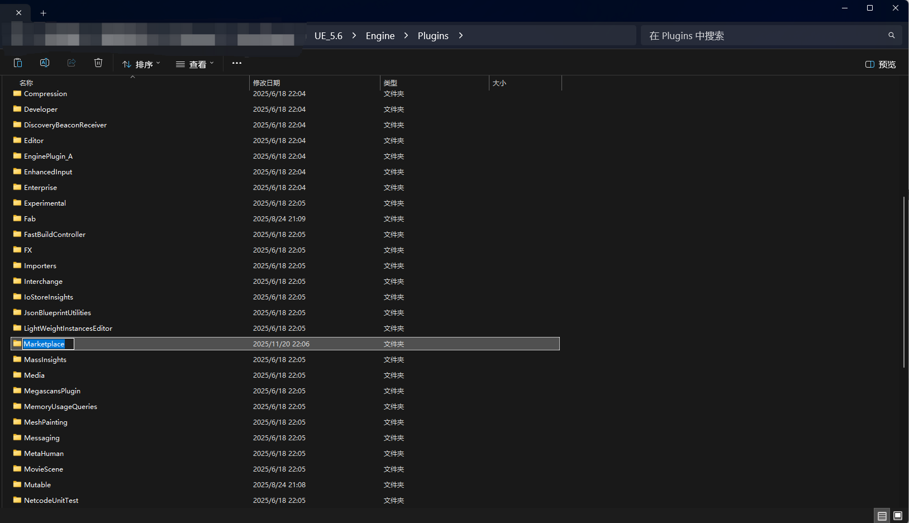{width=400}
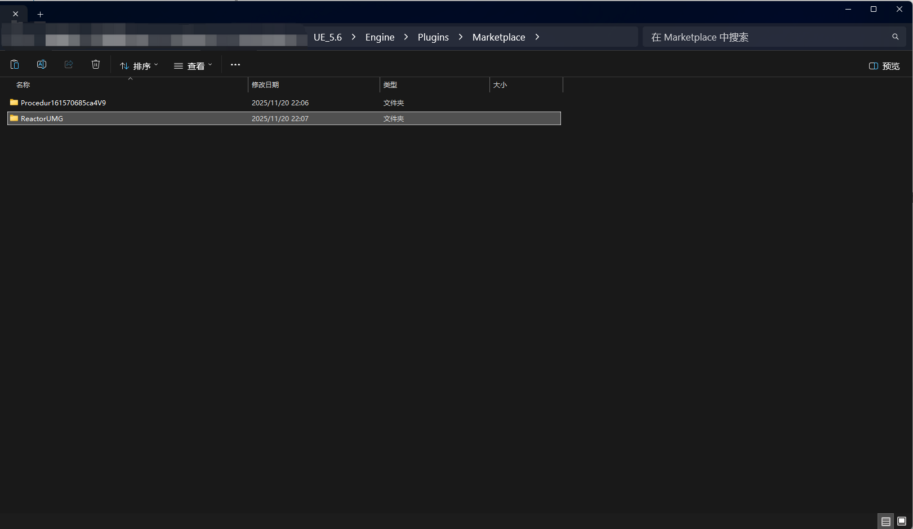{width=400}

并且在项目的`MyProject.uproject`uproject文件中启用插件：

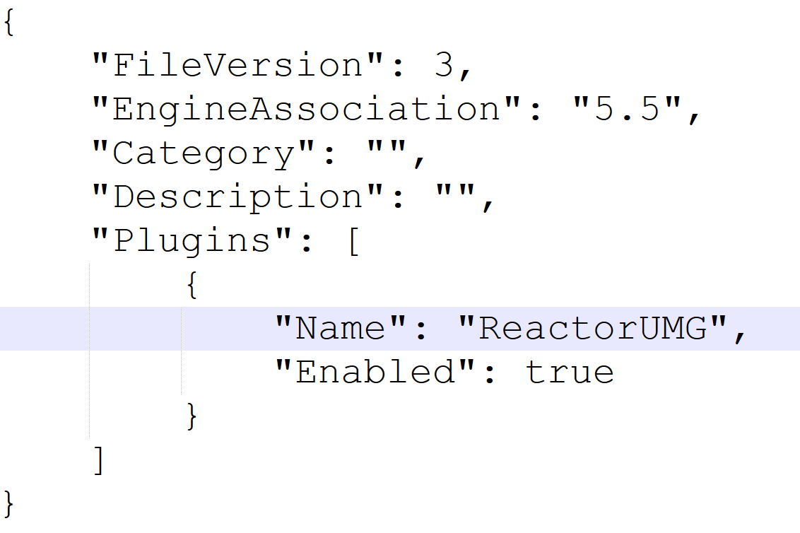{width=500}


- 项目目录**（推荐）**

**我们强烈推荐直接安装到项目目录，安装到引擎目录会影响所有项目。**

将zip文件解压后得到的`ReactorUMG`目录放置到项目的`Plugins`目录，参考以下示例：

{width=400}
{width=505}

### 源码编译

源码编译适用于大多数有UE程序经验的开发者，适合在C++项目或源码版引擎下使用，下面不赘述具体的编译过程，只列出关键步骤。

- 下载插件源码放置到项目`Plugins`目录；
- 完成[环境初始化](#eng_init)；
- 重新生成`Visual Studio project files`；
- 在Visual Studio或Rider中执行编译，并启动项目；

## 环境初始化 {#eng_init}

进入插件目录，找到`Plugins/ReactorUMG/Tools/setup_win.bat`环境初始化脚本。

{width=700}

注：暂不支持setup_linux.sh。

**双击执行**，执行过程如下：

{width=370}
{width=500}

初始化完成信息提示。

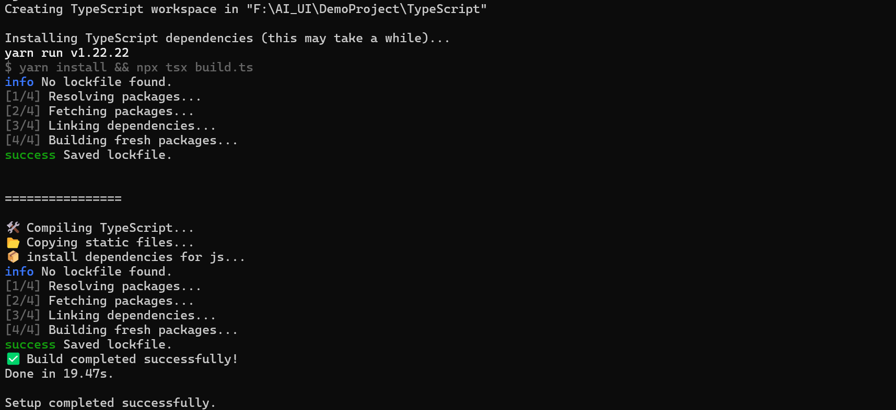{width=600}

环境初始化完成后就可以双击uproject文件来启动项目了。

## 创建编辑器UI

启动编辑器后，在**内容浏览器**的空白处点击右键弹出资产创建菜单，选中`ReactorUMG->EditorUtilityUMG`。

{width=600}

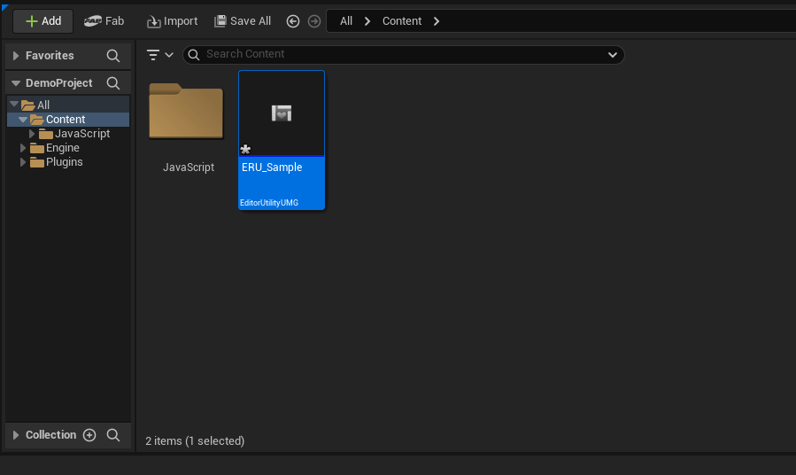{width=600}

将资产重命名为`ERU_Sample`，双击打开编辑器，首次打开会执行编译TS的操作，打开后我们能看到默认界面。
> 编辑器UI资产建议以`ERU_`前缀进行规范命名，游戏UI建议以`RU_`前缀命名。

{width=600}

## AI Coding

### 打开脚本工程

使用任意代码编辑器（VS Code/Cursor/WindSurf/Antigravity）打开`ProjectDir/TypeScript`目录，并找到`ERU_Sample`对应的`tsx`脚本文件，位于`ProjectDir/TypeScript/src/Editor/ERU_Sample/ERU_Sample.tsx`，如下图所示：

{width=400}
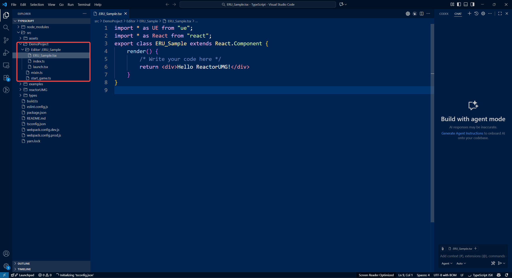{width=420}

!!! note "路径说明"
    1. `TypeScript`是ReactUMG的工程项目目录，由模板产生；

    2. `TypeScript/src/Editor`目录用于存放编辑器UI资产的所有脚本文件，子目录的命名规则为`TypeScript/src/Editor/<AssetName>`，`<AssetName>`为UE中的资产名。

    3. `TypeScript/src/Editor/<AssetName>`目录下默认会产生三个文件，分别为`index.ts`、`launch.tsx`、`<AssetName>.tsx`，其中`<AssetName>.tsx`是主界面脚本，新增代码写到此脚本文件中；其余两个文件不在这里讲述，详细内容查看[目录解读](#eng_init)。

### 编写示例

现在我们来做一个打开地图的小工具，输入以下提示词：
> 使用原生react ui组件写一个UI界面：1.输入框输入地图名；2. 点击按钮时打开地图；3. 检查地图是否存在，如果不存在则在界面底部通过红色字体显示警告信息；4. 代码添加到ERU_Sample组件中；

我这里使用`GPT Codex`插件来完成AI Coding。

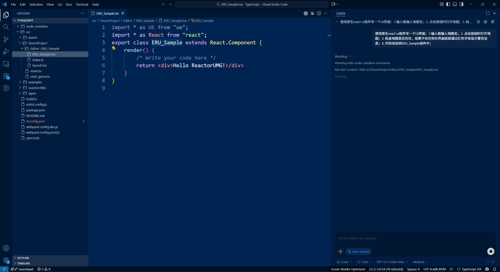{width=600}

生成后的代码如下：

```TypeScript
import * as UE from "ue";
import * as React from "react";

type State = {
    mapName: string;
    warning: string;
};

export class ERU_Sample extends React.Component<{}, State> {
    state: State = {
        mapName: "",
        warning: "",
    };

    private handleInputChange = (event: React.ChangeEvent<HTMLInputElement>) => {
        this.setState({ mapName: event.target.value, warning: "" });
    };

    private handleOpenMap = () => {
        const mapName = this.state.mapName.trim();
        if (!mapName) {
            this.setState({ warning: "Please enter a map name" });
            return;
        }

        // Assume maps are under /Game/Maps and share the same name as the input
        const mapPath = `/Game/Maps/${mapName}.${mapName}`;
        const exist = UE.EditorAssetLibrary.DoAssetsExist(mapPath);

        if (!exist) {
            this.setState({ warning: `Map "${mapName}" does not exist` });
            return;
        }

        this.setState({ warning: "" });
        UE.EditorLoadingAndSavingUtils.LoadMap(mapPath);
    };

    render() {
        const { mapName, warning } = this.state;

        return (
            <div style={{ display: "flex", flexDirection: "column", gap: 8, width: 320 }}>
                <label style={{ display: "flex", flexDirection: "column", gap: 4 }}>
                    <span>Map name</span>
                    <input
                        type="text"
                        value={mapName}
                        onChange={this.handleInputChange}
                        placeholder="Example: ExampleMap"
                        style={{ padding: 6, fontSize: 14 }}
                    />
                </label>

                <button
                    onClick={this.handleOpenMap}
                    style={{ padding: "6px 10px", fontSize: 14, cursor: "pointer" }}
                >
                    Open map
                </button>

                {warning && (
                    <div style={{ color: "red", marginTop: 4 }}>
                        {warning}
                    </div>
                )}
            </div>
        );
    }
}

```

我们注意到生成的代码对UE API的调用还不准确，需要我们手动更正一下。
```TypeScript
-        const mapPath = `/Game/Maps/${mapName}.${mapName}`;
-        const exist = UE.EditorAssetLibrary.DoAssetsExist(mapPath);
+       // 改成editor only调用并调整输入参数
+       const mapPath = UE.NewArray(UE.BuiltinString);
+       mapPath.Add(`/Game/Maps/${mapName}.${mapName}`);
+       const exist = UE.EditorAssetLibrary.DoAssetsExist_EditorOnly(mapPath);

-       UE.EditorLoadingAndSavingUtils.LoadMap(mapPath);
+       UE.EditorLoadingAndSavingUtils.LoadMap_EditorOnly(`/Game/Maps/${mapName}.${mapName}`);
```

!!! note "LLM输出质量"
    我们会在[教程与示例]()中讲解如何提高LLM的生成质量。核心思想就是让LLM学习UE API的内容。

## 预览和运行

插件会监控文件变化，当我们修改完脚本后，能够在UI编辑器中看到`Compile`按钮状态为提示编译状态，如下图所示：

{width=600}

点击编译，编译完成后可以看到静态布局界面：

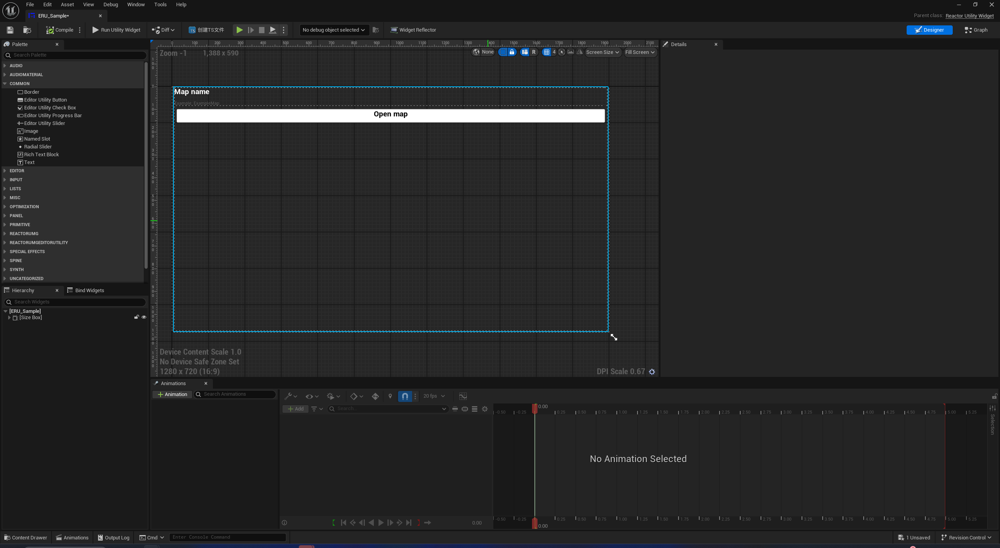{width=600}

点击`Run Utility Widget`运行编辑器UI，并测试功能：

{width=600}

**动态更新**：当我们修改UI界面后，可以点击`Compile`按钮重新动态加载页面；例如，我们将`ERU_Sample`的按钮文字颜色改成蓝色，如下图所示。

{width=600}

## 创建游戏UI

接下来，我们将演示如何创建游戏UI，以及如何添加到游戏中。

首先右键点击内容浏览器，选中`ReactorUMG->ReactorUMG`类型资产，并且重命名为`RU_Sample`，打开UI编辑器，使用AI Coding实现一个登录界面。

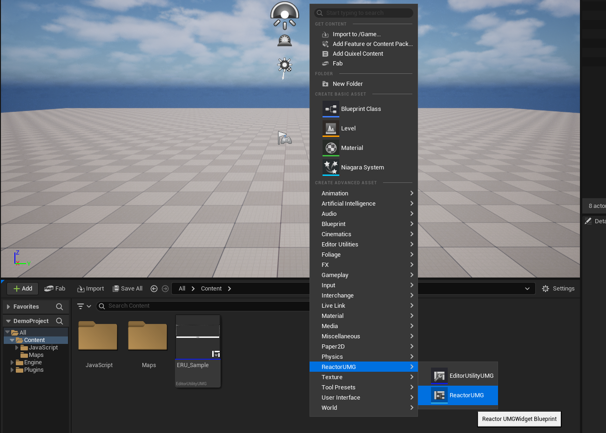{Width=600}

!!! note "游戏UI目录"
    游戏UI的所有脚本文件放置在`ProjectDir/TypeScript/src/RU_Sample`目录下。

生成的登录界面代码：[RU_Sample.tsx](./files/RU_Sample.tsx)

编辑器中的预览结果如下所示：

{width=600}

实例中我们在关卡蓝图中创建游戏UI Widget（用法与UserWidget一致，使用内置的CreateWidget蓝图库函数）并且添加到视口。

{Width=360}
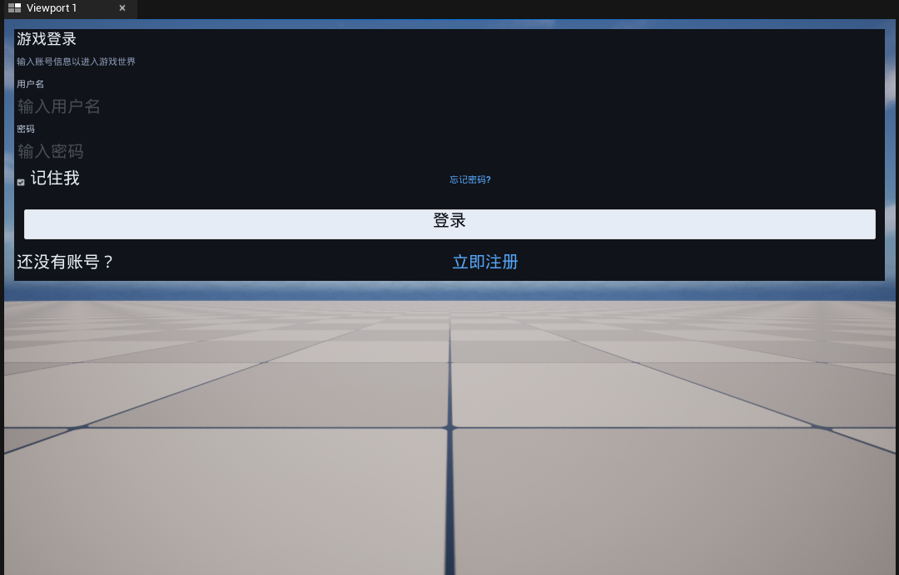{width=400}

## 脚本打包

1. 添加`Content/JavaScript`到`Non-Asset Directory`（系统自动完成）。
2. 使用webpack进行混淆打包；

## 目录解读

为了更好地使用插件，了解插件给整个项目带来的变化是必要的，尤其是文件目录这一部分。下面是示例工程的代码目录结构：

```plain
MyProject/
├─ Content/                         # UE 资源目录
│  └─ JavaScript/                   # JS运行脚本所在目录
├─ Plugins/
│  └─ ReactorUMG/                   # ReactorUMG 插件
│     ├─ Scripts/
│     │  ├─ Project/                # 项目模板
│     │  └─ System/JavaScript/      # 系统脚本
│     └─ Source/                    # 插件C++源码
├─ TypeScript/                      # React+TS 项目主目录, 由插件自动生成
│  ├─ src/
│  │  ├─ MyProject/                 # 
│  |  |  ├─ Editor/				    # 存放所有编辑器UI
│  |  |  |  └─ ERU_Sample/		    # 编辑器UI资产对应的脚本目录
│  |  |  |      ├─ index.tsx		# 默认导出模块声明
│  |  |  |      ├─ launch.tsx		# UI启动脚本
│  |  |  |      └─ RU_Test.tsx		# 实际UI运行脚本
│  |  │  └─ RU_Test/			    # 游戏UI资产对应的脚本目录
│  |  |     ├─ index.tsx		    # 默认导出模块声明
│  |  |     ├─ launch.tsx			# UI启动脚本
│  |  |     └─ RU_Test.tsx			# 实际UI运行脚本
│  │  ├─ reactorUMG/                # ReactorUMG 框架
│  │  └─ types/                     # Puerts/UE 类型声明
│  ├─ node_modules/                 # 依赖库
│  ├─ tsconfig.json                 # TS配置信息
│  └─ package.json                  # 项目配置
└─ MyProject.uproject
```

- `Content/JavaScript`：此目录下包含系统脚本+UI脚本，Puerts系统会在此目录下的查找并运行JS脚本。TS脚本`TypeScript/src/MyProject/Editor/ERU_Sample/RU_Test.tsx`经过tsc编译后会放置到`Content/JavaScript/src/MyProject/Editor/ERU_Sample/RU_Test.js`路径下。
- `TypeScript/src/MyProject/Editor/ERU_Sample/launch.tsx`：资产`ERU_Sample`对应的UI启动脚本，由系统生成切勿改动，否则影响正常运行。
- 资产`ERU_Sample`相关的UI程序推荐统一放置在`TypeScript/src/MyProject/Editor/ERU_Sample`目录下，公共组件可以抽离出来，相关实践将在[教程与示例]()中进行详细介绍。
- 编辑器UI放置在`TypeScript/src/MyProject/Editor/`，而游戏UI直接放置在`TypeScript/src/MyProject/`目录。这样做的目的是将编辑器UI抽离出来，方便在打包时将其排除掉。

## 原理介绍

我们将从两个方面介绍插件的运行原理：

1. 插件的实现架构是什么？
2. 如何将React UI转换成UMG Widget，脚本的执行过程是什么？

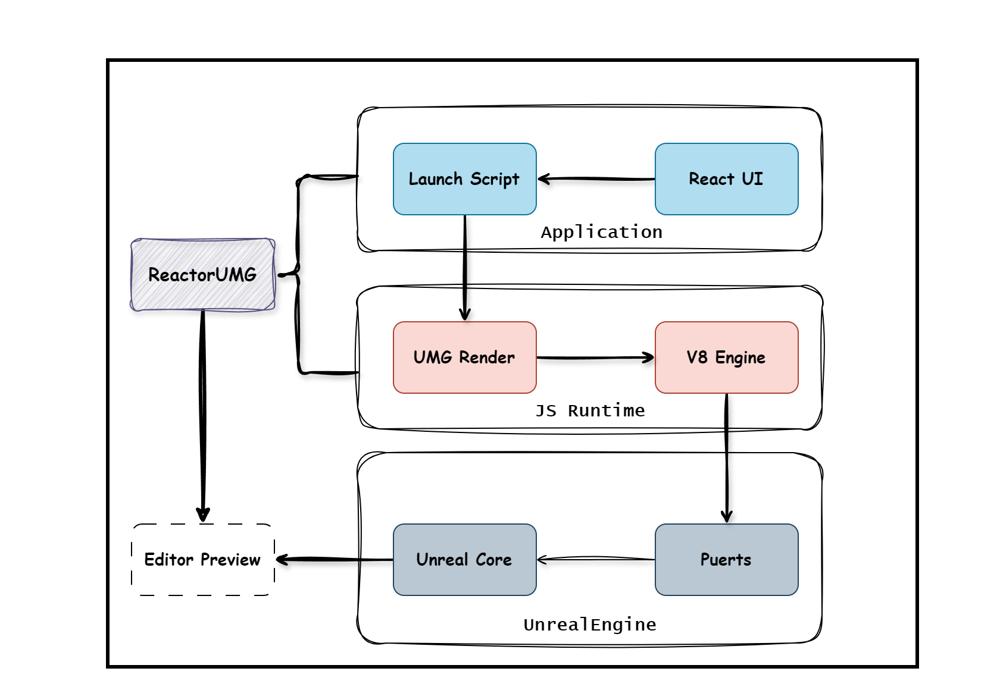{width=600}

- 如图所示，系统从上到下分为三层：应用层(Application)、JS运行层(JS Runtime)、UE层(UnrealEngine)。
- 系统以Puerts提供的JS调用UE引擎接口的功能为核心基础，在JS脚本层面开发了UMG Render，UMG Render基于react reconciler库实现自定义的react-dom渲染流程，主要负责将React组件翻译成UE UMGWidget，并完成CSS样式、容器布局等内容的适配。
- 应用层面，用户编写的React UI组件会统一在入口脚本Launch Script中将其以react node的参数形式传递到UMG Render中完成UI渲染。

执行过程可以简化为从用户自定义UI`UserDefined-UI`出发，在`UMG-Render`中遍历react firber树，并且通过`UMG-Converter`将react节点转换成UMG组件`Created-Widget`，最后将UMG组件按照firber树的遍历顺序重建出用于UMG Widget渲染的`WidgetTree`，过程如下图所示。

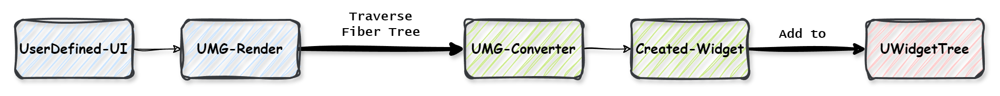{width=600}


